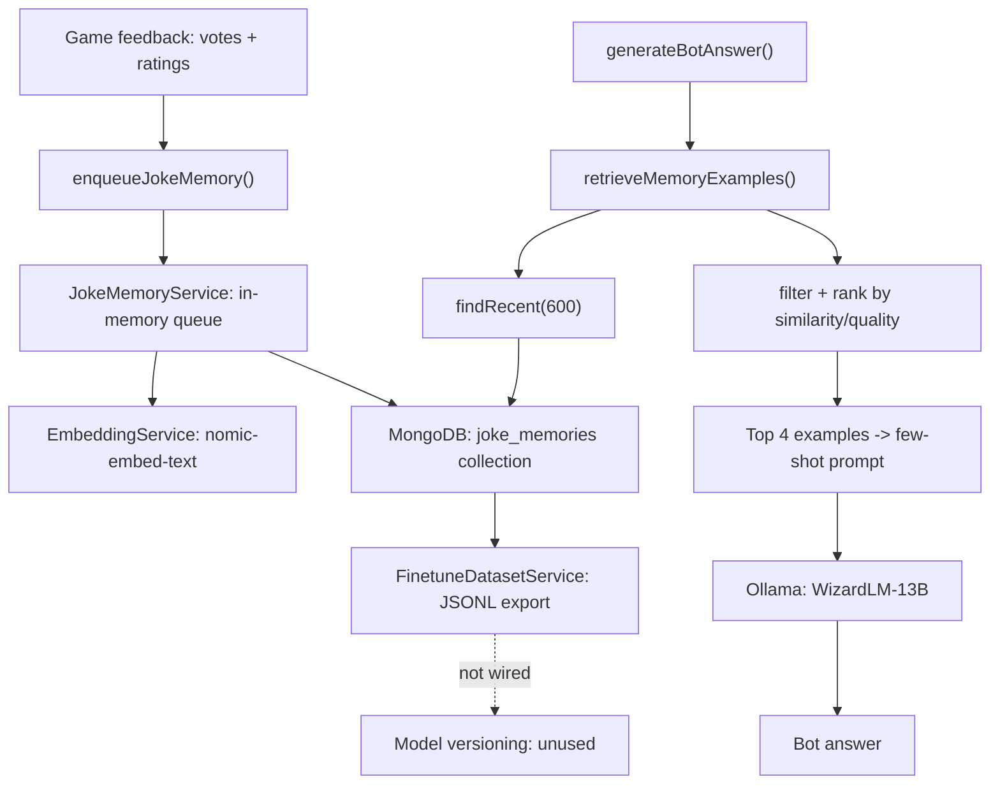

# Предложения по улучшению обучения бота

## Текущая архитектура (как есть)




---

## 1. Слабые стороны

### 1.1. Очередь записи в память — in-memory, без персистентности

Текущая реализация в [joke-memory.service.ts](api/src/modules/joke-memory/joke-memory.service.ts):

```94:104:api/src/modules/joke-memory/joke-memory.service.ts
  // ...
  private readonly recordQueue: RecordQueueItem[] = []
  // ...
```

Очередь живет в оперативной памяти. При рестарте контейнера все не обработанные записи теряются. Нет retry-логики — если запись в MongoDB или embedding-запрос упал, шутка просто пропадает.

**Решение:** Использовать MongoDB-backed очередь (отдельная коллекция `joke_memory_queue` со статусами `pending`/`processed`/`failed`). При старте сервиса — обработать все `pending`. При ошибке — пометить `failed` с retry-счетчиком.

### 1.2. Retrieval ограничен 600 последними записями

```12:12:api/src/modules/joke-memory/joke-memory.service.ts
const RECENT_POOL_SIZE: number = 600
```

Если база вырастет до тысяч шуток, старые качественные примеры будут недоступны. Retrieval сканирует 600 записей и считает cosine similarity в памяти — это не масштабируется.

**Решение (вариант A — простой):** Вместо `findRecent(600)` делать два запроса: `findRecent(300)` + `findTopQuality(300)` (по `qualityScore desc`). Это гарантирует, что лучшие шутки всех времен всегда попадают в пул.

**Решение (вариант B — продвинутый):** Добавить MongoDB Atlas Vector Search index на поле `promptEmbedding`. Тогда retrieval будет нативным `$vectorSearch` запросом без загрузки всего пула в память.

### 1.3. Нет негативных примеров

Текущий retrieval фильтрует только по `voteShare >= 0.52`. Бот видит только хорошие примеры, но не знает, какие паттерны провалились.

**Решение:** Добавить в промпт секцию "Anti-examples" — 1-2 шутки с низким `voteShare` (< 0.3) для того же промпта. В промпте указать: "Avoid patterns similar to these poorly received jokes." Это поможет модели избегать повторяющихся неудачных стратегий.

### 1.4. Стили бота выбираются случайно, без обратной связи

```33:34:api/src/modules/game/game.service.ts
const BOT_STYLES: readonly string[] = ['sarcastic', 'chaotic', 'dark', 'absurd', 'bold'] as const
```

Стиль выбирается рандомно через `getBotStyle()`. Нет данных о том, какой стиль побеждает чаще.

**Решение:** Сохранять `styleTag` в `JokeMemoryEntry`. При генерации ответа — считать win-rate по стилям из памяти и использовать взвешенный выбор (стили с высоким win-rate выбираются чаще, но не исключительно, чтобы сохранить exploration).

### 1.5. Метрики бота (win-rate) не используются

```57:58:api/src/modules/game/game.service.ts
  private botDuelWins: number = 0
  private botDuelTotal: number = 0
```

Эти счетчики живут в памяти, логируются каждые 20 дуэлей и сбрасываются при рестарте. Они не влияют на поведение бота.

**Решение:** Персистировать метрики в MongoDB (коллекция `bot_metrics`). Использовать win-rate для:

- Адаптивной temperature: если win-rate падает ниже порога — увеличить temperature (больше креативности); если растет — слегка снизить (закрепить успешный стиль).
- Логирования трендов и отслеживания деградации.

### 1.6. Fine-tune pipeline не подключен

[finetune-dataset.service.ts](api/src/modules/joke-memory/finetune-dataset.service.ts) умеет экспортировать JSONL и регистрировать версии моделей, но:

- Нет HTTP-эндпоинтов для запуска экспорта.
- Нет cron/scheduled job для автоматического экспорта.
- `model-versions.json` записывается, но никогда не читается при выборе модели.
- `OLLAMA_MODEL` зафиксирован при старте.

**Решение (минимальное):** Добавить REST-эндпоинт `POST /admin/finetune/export` для ручного запуска экспорта. Добавить `GET /admin/bot/metrics` для просмотра текущих метрик.

**Решение (полное):** Scheduled job (cron), который раз в N игр экспортирует датасет. После fine-tune — автоматическое обновление `OLLAMA_MODEL` через model versioning.

### 1.7. Нет версионирования embedding-модели

Если `nomic-embed-text` обновится или сменится на другую модель, старые embeddings станут несовместимыми. Поле `embeddingModel` записывается в схему, но при retrieval не проверяется.

**Решение:** При retrieval фильтровать записи по `embeddingModel === currentModel`. При смене модели — запустить миграцию (пересчитать embeddings для существующих записей).

---

## 2. Предложения по улучшению

### 2.1. Адаптивная temperature на основе win-rate

Текущая temperature зафиксирована:

```83:83:api/src/modules/ai/ai.service.ts
      temperature: 1.2
```

Идея: если бот стабильно проигрывает (win-rate < 0.35 за последние 20 дуэлей), поднять temperature до 1.4 для большей вариативности. Если побеждает (> 0.55) — снизить до 1.0, закрепляя успешные паттерны.

### 2.2. Контекстные стили на основе промпта

Вместо случайного стиля — анализировать промпт и выбирать стиль, который лучше подходит. Например, промпты про работу/собеседования -> `sarcastic`, промпты про технологии -> `absurd`. Это можно реализовать через простой keyword-matching или через отдельный LLM-запрос для классификации.

### 2.3. Diversity penalty при retrieval

Сейчас top-4 примера могут быть очень похожи друг на друга. Добавить MMR (Maximal Marginal Relevance) — при выборе каждого следующего примера штрафовать за сходство с уже выбранными. Это даст боту более разнообразные few-shot примеры.

### 2.4. Разделение human/bot примеров в памяти

Поле `source` (`'human' | 'bot'`) уже записывается, но при retrieval не используется. Можно:

- Приоритизировать human-примеры (они обычно качественнее).
- Фильтровать bot-примеры с низким score, чтобы бот не учился на своих же плохих шутках.

### 2.5. Self-play для офлайн-улучшения

Добавить возможность запускать "тренировочные" раунды без реальных игроков: бот генерирует N ответов на один промпт с разными стилями и temperature, затем другой LLM-запрос ранжирует их. Лучшие попадают в память с синтетическим score. Это позволит боту улучшаться между играми.

### 2.6. Prompt engineering: chain-of-thought для бота

Текущий промпт просит "one short punchline". Можно добавить скрытый chain-of-thought: попросить модель сначала придумать 3 варианта, затем выбрать лучший. Парсить только финальный ответ. Это увеличит latency, но может значительно улучшить качество.

### 2.7. Кэширование embeddings для промптов

Если один и тот же промпт встречается повторно (fallback-промпты, популярные AI-генерированные), embedding считается заново каждый раз. Простой LRU-кэш на 100-200 записей сэкономит вызовы к Ollama.

---

## 3. Приоритеты


| Приоритет | Улучшение                        | Сложность | Влияние             |
| --------- | -------------------------------- | --------- | ------------------- |
| Высокий   | 1.2 — Retrieval pool (вариант A) | Низкая    | Высокое             |
| Высокий   | 1.3 — Негативные примеры         | Низкая    | Среднее             |
| Высокий   | 1.4 — Стили с обратной связью    | Средняя   | Высокое             |
| Средний   | 1.1 — Персистентная очередь      | Средняя   | Среднее             |
| Средний   | 1.5 — Персистентные метрики      | Низкая    | Среднее             |
| Средний   | 2.1 — Адаптивная temperature     | Низкая    | Среднее             |
| Средний   | 2.3 — MMR diversity              | Средняя   | Среднее             |
| Средний   | 2.4 — Приоритет human-примеров   | Низкая    | Среднее             |
| Низкий    | 1.6 — Fine-tune endpoints        | Средняя   | Высокое (долгосрок) |
| Низкий    | 2.5 — Self-play                  | Высокая   | Высокое (долгосрок) |
| Низкий    | 2.6 — Chain-of-thought           | Низкая    | Среднее             |
| Низкий    | 2.7 — Embedding cache            | Низкая    | Низкое              |
| Низкий    | 1.7 — Embedding versioning       | Средняя   | Низкое              |


